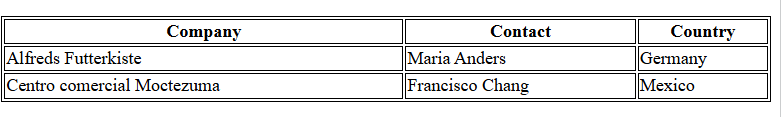
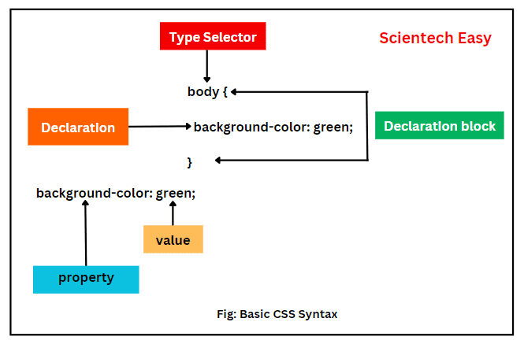

# 📘 HTML in CSS

Živjo! To stran sem naredila, da hitro najdeš značko, ki jo potrebuješ. Upam, da ti bo koristilo in veliko uspeha pri grajenju strani. 🎉

## Strani, ki mi vedno pridejo prav
- Super stran za pomoč pri html in css<br> https://www.w3schools.com/html/default.asp
- Izbira barv<br>https://www.canva.com/colors/color-wheel/

- Stran za ikone<br> https://www.flaticon.com/free-icons/finder
- Stran za gif-e<br> https://giphy.com/
- Stran za slike<br> https://pixabay.com/
---

# Kazalo

1. [Osnovna HTML struktura](#osnovna-html-struktura)
2. [Naslovi](#naslovi)
3. [Odstavki](#odstavki)
4. [Urejanje besedila](#urejanje-besedila)
5. [Linki](#linki)
6. [Slike](#slike)
7. [Seznami](#seznami)
8. [Tabele](#tabele)
9. [Link do CSS](#link-do-css)
10. [CSS za značke](#css-za-značke)
11. [CSS in barve](#css-in-barve)
12. [Slika za ozadje](#slika-za-ozadje)
13. [Dekoriranje besedila](#dekoriranje-besedila)

---

# Osnovna HTML struktura

```html
<!DOCTYPE html>
<html>
<head>
    <title>Moja stran</title>
</head>
<body>
    <h1>Živjo!</h1>
</body>
</html>
```
### Želiš da bi title na zavihku imel ikono?
```html
<link rel="icon" href="pot_do_ikone">
```

---

# Naslovi
```html
<h1>Največji naslov</h1>
<h2>Malo manjši</h2>
<h3>Še malo manjši</h3>
<h4>Še še manjši</h4>
<h5>Že zelo majhen</h5>
<h6>Najmanjši naslov</h6>
```

# Odstavki

```html
<p>To je besedilo.</p>
```

# Urejanje besedila

```html
<br> -> Gre v novo vrstico.
<hr> -> Naredi črto čez stran
```
```html
<b>Odebeljeno besedilo</b>

<strong>Pomebno besedilo</strong>

<i>italic/poševno besedilo</i>

<u>Podčrtano besedilo</u>

<del>Prečrtano besedilo</del>

<mark>Označeno z barvo</mark>
```

# Linki

```html
<a href="url">link text</a>
```
Atribut target
- _self -> Odpre v istem zavihku, kjer se nahajamo
```html
<a href="url" target="_self">link text</a>
```
- _blank -> Odpre v novem zavihku (Zmeraj priporočam!!!)
```html
<a href="url" target="_blank">link text</a>
```
### Kako uporabimo sliko kot link?
```html
<a href="default.asp"></a>
```
###Ne želiš imeti črte pod linkom?
```css
a {
  text-decoration: none;
}
```

---

# Slike

Atribut <i>src</i> definira pot do slike. Atribut <i>alt</i> definira ime slike.
```html

```
### Si želiš, da bi bila slika, desno ali levo od besedila?
```html
<p>
Ta slika bo bila desno od besedila</p>

<p>
Ta slika bo bila levo od besedila</p>
```
---

# Seznami
Na voljo imamo <b>urejen/ordered</b>, kar pomeni da lahko vrstice številčimo.
<br>
1. Mačka
2. Kuža
3. Papiga

```html
<ol>
  <li>Mačka</li>
  <li>Kuža</li>
  <li>Papiga</li>
</ol>
```
Na voljo je nekaj drugih tipov oštevilčenja.
```html
<ol type = "1">
<ol type = "I">
<ol type = "i">
<ol type = "A">
<ol type = "a">
```
In pa <b>neurejen/unordered</b> seznam, kjer vrsticam dodamo krogce.
- Kava
- Čaj
- Mleko
```html
<ul>
  <li>Kava</li>
  <li>Čaj</li>
  <li>Mleko</li>
</ul>
```
Prav tako je na voljo nekaj drugih tipov.
```html
<ul type = "disc">
<ul type = "circle">
<ul type = "square">
```
### Si želiš uporabiti ikonco?
```html
<ul style="list-style-type: '💵';">
```
---

# Tabele

```html
<table style="width:100%">
  <tr>
    <th>Company</th>
    <th>Contact</th>
    <th>Country</th>
  </tr>
  <tr>
    <td>Alfreds Futterkiste</td>
    <td>Maria Anders</td>
    <td>Germany</td>
  </tr>
  <tr>
    <td>Centro comercial Moctezuma</td>
    <td>Francisco Chang</td>
    <td>Mexico</td>
  </tr>
</table>
```
# Link do CSS

Najprej vedno poglej če si HTML stran povezal z CSS.
```css
<link rel="stylesheet" href="mystyle.css">
```

# CSS za značke


Recimo, da bi želeli, da ima naša stran barvno ozadje. Katera značka zajame celotno stran? Tako je, body je ta zanačka.
```css
body {
    background-color: blue;
}
```
Ti <i>h1</i> naslov ni dovolj velik? Ni problema, povečaj ga s css.
```css
h1 {
    font-size: 20px;
}
```
# CSS in barve

- Barva pisave
```css
p {
    color: pink;
}
```
- Barva ozadja
```css
p {
    background-color: rgb(255, 99, 71);
}
```
- Barva obrobja
```css
p {
    border: #ff6347;
}
```

# Slika za ozadje
```css
body {
    background-image: url("paper.gif");
}
```

# Dekoriranje besedila
- Poravnava besedila, na voljo so: left, right, center, justify.

```css
h1 {
    text-align: center;
}

h1 {
    text-align: left;
}

h1 {
    text-align: right;
}

h1 {
    text-align: justify;
}

<!-- Justify naredi, da je besedilo raztegnjeno enakomerno čez celotno stran.
-->

```

- Dodaj črto k besedilu

```css
<!-- Črta nad besedilom
-->
h1 {
  text-decoration-line: overline;
}

<!-- Črta čez besedilo
-->
h2 {
  text-decoration-line: line-through;
}

<!-- Črta pod besedilom
-->
h3 {
  text-decoration-line: underline;
}

<!-- Črta nad in pod besedilom
-->
p {
  text-decoration-line: overline underline;
}
```
Lahko spreminiš barvo črte
```css
 text-decoration-color: red;
```
Lahko spremeniš izgled črte
```css
text-decoration-style: solid;

text-decoration-style: double;

text-decoration-style: dotted;

text-decoration-style: dashed;

text-decoration-style: wavy;
```
Določiš lahko tudi debelino
```css
text-decoration-thickness: 5px;
```
- Senca pri besedilu
<p style="text-shadow: 2px 2px 5px red;">Dodaj senco</p>

```css
h1 {
  text-shadow: 2px 2px 5px red;
}
```
# Fonti besedila


