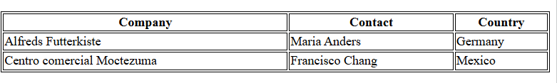
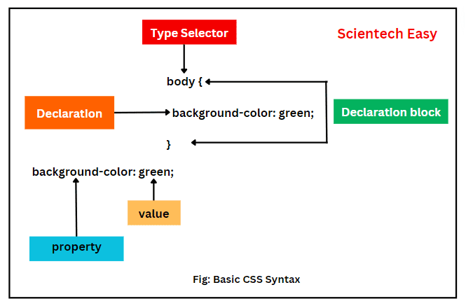

# 📘 HTML in CSS

Živjo! To stran sem naredila, da hitro najdeš značko, ki jo potrebuješ. Upam, da ti bo koristilo in veliko uspeha pri grajenju strani. 🎉

## Strani, ki mi vedno pridejo prav
- Super stran za pomoč pri html in css<br> https://www.w3schools.com/html/default.asp
- Izbira barv<br>https://www.canva.com/colors/color-wheel/

- Stran za ikone<br> https://www.flaticon.com/free-icons/finder
- Stran za gif-e<br> https://giphy.com/
- Stran za slike<br> https://pixabay.com/
---

# Kazalo

1. [Osnovna HTML struktura](#osnovna-html-struktura)
2. [Naslovi](#naslovi)
3. [Odstavki](#odstavki)
4. [Urejanje besedila](#urejanje-besedila)
5. [Linki](#linki)
6. [Slike](#slike)
7. [Seznami](#seznami)
8. [Tabele](#tabele)
9. [Gumbi](#gumbi)
10. [Link do CSS](#link-do-css)
11. [CSS za značke](#css-za-značke)
12. [CSS in barve](#css-in-barve)
13. [Slika za ozadje](#slika-za-ozadje)
14. [Dekoriranje besedila](#dekoriranje-besedila)
15. [Fonti besedila](#fonti-besedila)
16. [CSS in slike](#css-in-slike)
17. [Div, class, id](#div-class-id)
18. [Navigacijski meni](#navigacijski-meni)
19. [Grid](#grid)
20. [Flex](#flex)
21. [Pozicioniranje](#pozicioniranje)
---

# Osnovna HTML struktura

```html
<!DOCTYPE html>
<html>
<head>
    <title>Moja stran</title>
</head>
<body>
    <h1>Živjo!</h1>
</body>
</html>
```
### Želiš da bi title na zavihku imel ikono?
```html
<link rel="icon" href="pot_do_ikone">
```

---

# Naslovi
```html
<h1>Največji naslov</h1>
<h2>Malo manjši</h2>
<h3>Še malo manjši</h3>
<h4>Še še manjši</h4>
<h5>Že zelo majhen</h5>
<h6>Najmanjši naslov</h6>
```
---
# Odstavki

```html
<p>To je besedilo.</p>
```
---
# Urejanje besedila

```html
<br> -> Gre v novo vrstico.
<hr> -> Naredi črto čez stran
```
```html
<b>Odebeljeno besedilo</b>

<strong>Pomebno besedilo</strong>

<i>italic/poševno besedilo</i>

<u>Podčrtano besedilo</u>

<del>Prečrtano besedilo</del>

<mark>Označeno z barvo</mark>
```
---
# Linki

```html
<a href="url">link text</a>
```
Atribut target
- _self -> Odpre v istem zavihku, kjer se nahajamo
```html
<a href="url" target="_self">link text</a>
```
- _blank -> Odpre v novem zavihku (Zmeraj priporočam!!!)
```html
<a href="url" target="_blank">link text</a>
```
### Kako uporabimo sliko kot link?
```html
<a href="default.asp"></a>
```
### Ne želiš imeti črte pod linkom?
```css
a {
  text-decoration: none;
}
```
---

# Slike

Atribut <i>src</i> definira pot do slike. Atribut <i>alt</i> definira ime slike.
```html

```
### Si želiš, da bi bila slika, desno ali levo od besedila?
```html
<p>
Ta slika bo bila desno od besedila</p>

<p>
Ta slika bo bila levo od besedila</p>
```
---

# Seznami
Na voljo imamo <b>urejen/ordered</b>, kar pomeni da lahko vrstice številčimo.
<br>
1. Mačka
2. Kuža
3. Papiga

```html
<ol>
  <li>Mačka</li>
  <li>Kuža</li>
  <li>Papiga</li>
</ol>
```
Na voljo je nekaj drugih tipov oštevilčenja.
```html
<ol type = "1">
<ol type = "I">
<ol type = "i">
<ol type = "A">
<ol type = "a">
```
In pa <b>neurejen/unordered</b> seznam, kjer vrsticam dodamo krogce.
- Kava
- Čaj
- Mleko
```html
<ul>
  <li>Kava</li>
  <li>Čaj</li>
  <li>Mleko</li>
</ul>
```
Prav tako je na voljo nekaj drugih tipov.
```html
<ul type = "disc">
<ul type = "circle">
<ul type = "square">
```
### Si želiš uporabiti ikonco?
```html
<ul style="list-style-type: '💵';">
```
---

# Tabele

```html
<table style="width:100%">
  <tr>
    <th>Company</th>
    <th>Contact</th>
    <th>Country</th>
  </tr>
  <tr>
    <td>Alfreds Futterkiste</td>
    <td>Maria Anders</td>
    <td>Germany</td>
  </tr>
  <tr>
    <td>Centro comercial Moctezuma</td>
    <td>Francisco Chang</td>
    <td>Mexico</td>
  </tr>
</table>
```
---
# Gumbi
```html
<button>Click Me</button>
```
### Ko klikneš gumb, te pelje na novo stran
```html
<button onclick="location.href='http://www.example.com'" type="button">
         www.example.com</button>
```
---
# Link do CSS

Najprej vedno poglej, če si HTML stran povezal z CSS.
```css
<link rel="stylesheet" href="mystyle.css">
```
---
# CSS za značke


Recimo, da bi želeli, da ima naša stran barvno ozadje. Katera značka zajame celotno stran? Tako je, body je ta zanačka.
```css
body {
    background-color: blue;
}
```
Ti <i>h1</i> naslov ni dovolj velik? Ni problema, povečaj ga s css.
```css
h1 {
    font-size: 20px;
}
```
---
# CSS in barve

- Barva pisave
```css
p {
    color: pink;
}
```
- Barva ozadja
```css
p {
    background-color: rgb(255, 99, 71);
}
```
- Barva obrobja
```css
p {
    border: #ff6347;
}
```
---
# Slika za ozadje
```css
body {
    background-image: url("paper.gif");
}
```
---
# Dekoriranje besedila
- Poravnava besedila, na voljo so: left, right, center, justify.

```css
h1 {
    text-align: center;
}

h1 {
    text-align: left;
}

h1 {
    text-align: right;
}

h1 {
    text-align: justify;
}

<!-- Justify naredi, da je besedilo raztegnjeno enakomerno čez celotno stran.-->

```

- Dodaj črto k besedilu

```css
/* Črta nad besedilom */
h1 {
  text-decoration-line: overline;
}

/* Črta čez besedilo */
h2 {
  text-decoration-line: line-through;
}

/* Črta pod besedilom */
h3 {
  text-decoration-line: underline;
}

/* Črta nad in pod besedilom */
p {
  text-decoration-line: overline underline;
}
```
Lahko spreminiš barvo črte
```css
text-decoration-color: red;
```
Lahko spremeniš izgled črte
```css
text-decoration-style: solid;

text-decoration-style: double;

text-decoration-style: dotted;

text-decoration-style: dashed;

text-decoration-style: wavy;
```
Določiš lahko tudi debelino
```css
text-decoration-thickness: 5px;
```
- Senca pri besedilu
```css
h1 {
  text-shadow: 2px 2px 5px red;
}
```
---
# Fonti besedila

```css
h1 {
  font-family: serif;
}

h1 {
  font-family: sans-serif;
}

h1 {
  font-family: fantasy;
}

h1 {
  font-family: monospace;
}

h1 {
  font-family: cursive;
}
```
---
# CSS in slike

Sliki lahko spreminjamo velikost.
```css
img {
  height: 200px;
  width: 200px;
}
```
Moje priporočilo je, da najprej pogledaš katera stranica je manjša, spreminiš ta atribut, drugega nastaviš na <i>auto</i>. Tako boš ohranil kvaliteto slike.
```css
img {
  width: 200px;
  height: auto;
}
```
---

# Div, class, id

### Div

Div predstavlja nahrbnik. V njega zapakiras vse kar si želiš, da bila nekakšna celota. 
```html
<div class="okvirji">
    
    <p>Ime: Haley</p>
    <p>Najljubša barva: Roza</p>
</div>
```
```css
.okvirji{
	border: solid 1px hotpink;
}
```


### id
Če želiš, da imamo samo en specifečen element,div,... določeno css kodo. Id je načeloma lahko samo enkrat uporabljen. Uporabiš # pred imenom.
```html
<h1 id="Glavni_naslov">Predstavitev likov v Stardew valley</h1>
```
```css
#Glavni_naslov{
	color: violet;
	font-family: sans-serif;
}
```

### class
Ko želiš, da ima več elementov, div-ov,... enako css kodo. Class se lahko uporabi večkrat v html kodi. Uporabiš . pred imenom. Glej primer pri div.

# Navigacijski meni
Naj prej narediš seznam.
```html
<ul>
  <li><a href="#home">Home</a></li>
  <li><a href="#news">News</a></li>
  <li><a href="#contact">Contact</a></li>
  <li><a href="#about">About</a></li>
</ul>
```
Z css dosežemo, da seznam zgleda kot navigacija.
```css
ul {
  list-style-type: none;
  margin: 0;
  padding: 0;
  overflow: hidden;
  background-color: #333333;
}

ul li {
  float: left;
}

ul li a {
  display: block;
  color: white;
  text-align: center;
  padding: 14px 16px;
  text-decoration: none;
}

ul li a:hover {
  background-color: #111111;
}
```
Če želite, da je navigacija vedno vidna.
```css
ul {
  position: fixed;
  top: 0;
  width: 100%;
}
```

# Grid

Naj prej ustvari div, ki bo predstavljal okvir za vse ostale div, ki jih želiš dodati.
```html
<body>
	<div id="grid">
		//Vsi ostali div, slike, besedilo
	</div>
</body>
```

Da bo element spletne strani del grid nujno potrebuje id ali class, div ni pogoj.
V css naj prej povej, da uporabljamo grid in kateri div je glavni.
```css
#grid {
	display: grid;
	grid-template-columns: 1fr 1fr;
	grid-template-areas: 
	'nav nav'
	'prva opis1'
	'gumb opis2'
	'opis3 slika2';
}
```
Ostalim elementom moramo povedati, kako jim je ime, vsaj večino časa ne zazna imen id ali class-ov.
```css
#nav {
	grid-area: nav;
}
```

# Flex
Za enodimenzionalno urejenje uporabljamo Flex.
```css
#slike {
	display: flex;
}
```
Elementi znotraj div-a so lahko v vrsti ali v stolpcu.
```css
#slike {
	display: flex;
	flex-direction: row;
	//ali
	flex-direction: column;
	//ali
	flex-direction: row-reverse;
	//ali
	flex-direction: column-reverse
}
```


# Pozicioniranje

Vedno se najprej vprašaj ali želiš poravnati EN element ali VEČ.

self -> en element
items -> vsi elementi znotraj nečesa
content -> razporeditev prostora

Justify uporabljamo za poravnavo po glavni osi (x-os).
- justify-content: center;
- justify-content: space-between;
- justify-content: space-around;
- justify-content: space-evenly;

Ko delamo flex moramo paziti, saj ko postavimo elemente v stolpec se osi zamenjata.
Pri flex-direction: row; -> vodoravno (x-os)
Pri flex-direction: column -> navpično (y-os)

Align pa uporabljamo pri y-osi.
- align-items: center;
- align-items: flex-start;
- align-items: flex-end;
- align-items: stretch;

Če želimo razmik pri med elementi lahko uporabimo GAP.
```css
#slike {
	display: flex;
	flex-direction: row;
	gap: 20px;
}
```
Ko imamo več slik in nam ni všeč da se gužvajo v eni vrsti lahko uporabimo WRAP, ki pa lepo razporedi elemente in jih po potrebi do v novo vrstico, če prostora več ni.
```css
#slike {
	display: flex;
	flex-direction: row;
	flex-wrap: wrap;
}
```

# Input
```html
<form>
  <label for="fname">First name:</label>
  <input type="text" id="fname" name="fname"><br><br>
  <label for="lname">Last name:</label>
  <input type="text" id="lname" name="lname"><br><br>
  <input type="submit" value="Submit">
</form>
```


```html
<input type="button">
<input type="checkbox">
<input type="color">
<input type="date">
<input type="datetime-local">
<input type="email">
<input type="file">
<input type="hidden">
<input type="image">
<input type="month">
<input type="number">
<input type="password">
<input type="radio">
<input type="range">
<input type="reset">
<input type="search">
<input type="submit">
<input type="tel">
<input type="text"> (default value)
<input type="time">
<input type="url">
<input type="week">
```
```html
<form>
  <input type="checkbox" id="vehicle1" name="vehicle1" value="Bike">
  <label for="vehicle1"> I have a bike</label><br>
  <input type="checkbox" id="vehicle2" name="vehicle2" value="Car">
  <label for="vehicle2"> I have a car</label><br>
  <input type="checkbox" id="vehicle3" name="vehicle3" value="Boat">
  <label for="vehicle3"> I have a boat</label><br><br>
  <input type="submit" value="Submit">
</form>
```


```html
<form>
  <label for="birthday">Birthday:</label>
  <input type="date" id="birthday" name="birthday">
  <input type="submit">
</form>
```html


```html
<form action="/action_page.php">
  <label for="vol">Volume (between 0 and 50):</label>
  <input type="range" id="vol" name="vol" min="0" max="50">
  <input type="submit">
</form>
```


```html
<textarea id="w3review" name="w3review" rows="4" cols="50">
At w3schools.com you will learn how to make a website. They offer free tutorials in all web development technologies.
</textarea>
```


